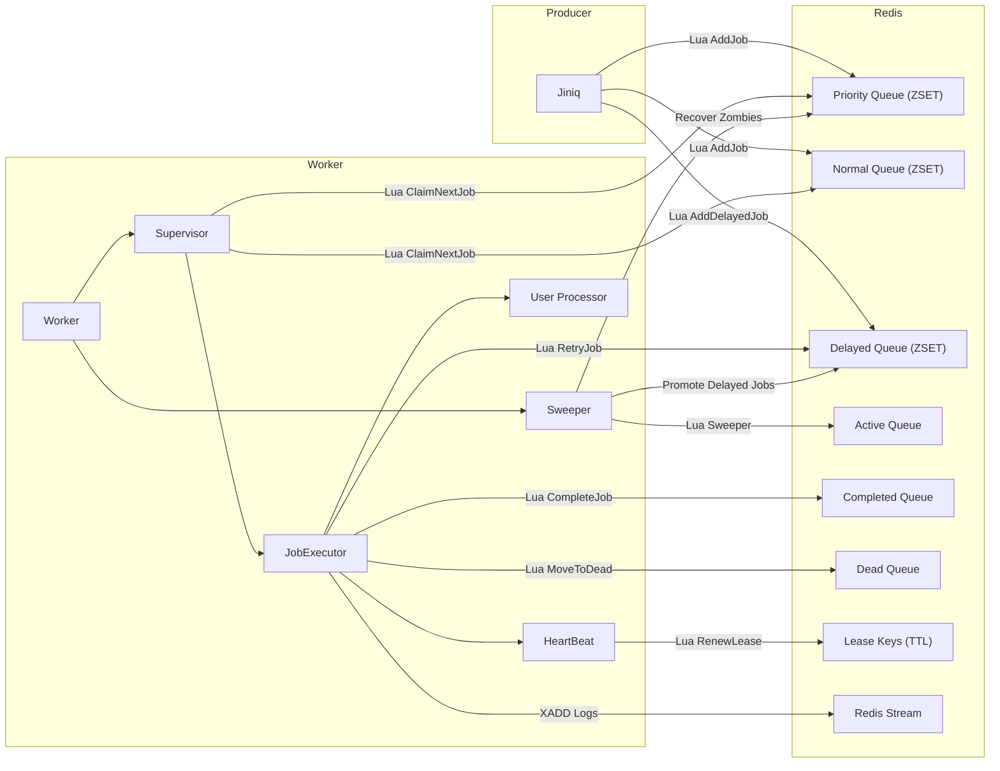

# JiNiQ

**A Redis-backed job queue for Node.js, built for correctness under failure — not just happy-path throughput.**

Most job queue tutorials show you `queue.add()` and stop there. JiNiQ exists because the hard part of a job queue isn't adding jobs — it's what happens when a worker dies mid-job, when 10,000 low-priority jobs starve out the 5 high-priority ones behind them, or when two workers race to claim the same job. JiNiQ is a from-scratch exploration of those problems, using Lua scripting for atomicity, lease-based heartbeats for failure detection, and a two-queue design that guarantees high-priority jobs never wait forever.

---

## Why JiNiQ Exists

Job queues look simple until you ask three questions:

- **What happens when a worker crashes while holding a job?** Without a lease/heartbeat mechanism, that job is gone forever — silently.
- **What stops high-priority jobs from starving behind a backlog of low-priority ones?** A single sorted structure with priority-only ordering will happily starve you.
- **What guarantees "claim" is atomic across concurrent workers?** If claiming a job isn't a single atomic operation, two workers *will* eventually grab the same job.

JiNiQ was built to answer these directly rather than hand-wave past them — every state transition (waiting → active → completed/failed/dead) happens inside a Lua script executed atomically on Redis, and every active job is protected by a heartbeat-renewed lock with a zombie sweeper watching for lapses.

---

## Features

- **Atomic state transitions** — every queue operation (add, claim, complete, fail, retry) runs as a single Lua script on Redis. No race windows.
- **Two-queue anti-starvation scheduling** — priority and normal jobs live in separate ZSETs, merged at claim-time using a time-offset comparison so priority jobs jump the queue without starving normal jobs indefinitely.
- **Age-based promotion** — jobs are scored by timestamp in their ZSET, so older jobs naturally rise instead of being buried by newer ones.
- **Heartbeat lease renewal** — active workers renew a TTL-based lock on their job at a fraction of the lock's TTL. Miss enough heartbeats and the job is presumed dead.
- **Zombie job recovery** — a background sweeper scans the active queue for jobs whose lock has expired (worker crashed, network partition, process killed) and requeues or dead-letters them based on attempt count.
- **Delayed jobs** — schedule a job to become claimable after a delay; a sweeper cycle promotes it once it's due.
- **Dead-letter queue** — jobs that exceed `maxAttempts` are routed to a dead queue instead of retried forever.
- **Bulk job submission** — add thousands of jobs via Redis pipelining with configurable chunk size, with per-job success/failure reporting instead of an all-or-nothing failure.
- **Queue size limits** — optional `maxQueueSize` guard that rejects new jobs once the queue is saturated, enforced atomically inside the same Lua script that adds the job.
- **Concurrency-aware workers** — each worker claims up to `maxConcurrency` jobs at once and self-throttles polling (exponential backoff) when the queue is empty.
- **Live log streaming** — job lifecycle events (started, completed, failed) are published to a Redis stream for dashboards or observability tooling to consume.

---

## Installation

```bash
npm install jiniq ioredis
```

JiNiQ uses [ioredis](https://github.com/redis/ioredis) under the hood and expects a running Redis instance (Redis 5+ recommended for stream support).

---

## Quick Start

**Producer — add jobs to a queue:**

```js
const { Jiniq } = require("jiniq");

const queue = new Jiniq("email-queue", {
  redisConfig: { host: "127.0.0.1", port: 6379 },
  maxQueueSize: 50000,
});

await queue.addJob("send-welcome-email", { userId: 123, email: "user@example.com" });

await queue.addBulk([
  { name: "send-welcome-email", payload: { userId: 124 } },
  { name: "send-welcome-email", payload: { userId: 125 }, options: { priority: "high" } },
]);
```

**Consumer — process jobs:**

```js
const { Worker } = require("jiniq");

const worker = new Worker(
  "email-queue",
  async (payload, signal) => {
    await sendEmail(payload); // your job logic
    return { sent: true };
  },
  {
    redisConfig: { host: "127.0.0.1", port: 6379 },
    concurrency: 5,
    lockDuration: 30000,
  }
);

worker.on("job:completed", ({ jobId, result }) => console.log(`✔ ${jobId}`, result));
worker.on("job:failed", ({ jobId, error }) => console.error(`✘ ${jobId}`, error));

await worker.start();

process.on("SIGTERM", async () => {
  await worker.stop();
});
```

---

## Basic Example: Priority Jobs

```js
// Normal priority — processed in submission order (age-based)
await queue.addJob("resize-image", { imageId: 42 });

// High priority — jumps ahead of the normal queue without starving it
await queue.addJob("resize-image", { imageId: 43 }, { priority: "high" });

// Delayed — becomes claimable in 60 seconds
await queue.addJob("send-reminder", { userId: 7 }, { delay: 60000 });
```

---

## Architecture



**Key design decision:** every write to shared queue state (add, claim, complete, fail, sweep) is a single Lua script — never a sequence of separate Redis commands from Node. This is what makes concurrent workers safe without a distributed lock library.

---

## Performance Highlights

> Benchmarks are being finalized against BullMQ under equivalent load (single-node Redis, N concurrent workers, job payload ~1KB). Numbers will be published here once complete — flagging that this section is in progress rather than filling it with placeholder figures.

What's already true by design, independent of raw throughput numbers:
- **O(log N) claim operations** — job claiming is backed by Redis ZSETs, not O(N) list scans.
- **Chunked pipelining for bulk inserts** — bulk job submission batches into pipelined Lua calls (configurable chunk size) instead of one round-trip per job.
- **Zero polling overhead when idle** — worker poll interval backs off exponentially (up to 2s) when the queue is empty, instead of hammering Redis continuously.

---

## Documentation

- [Architecture Deep Dive](./docs/ARCHITECTURE.md) *(in progress)*
- [Lua Script Reference](./docs/LUA_SCRIPTS.md) *(in progress)*
- [API Reference](./docs/API.md) *(in progress)*
- [Failure Modes & Recovery](./docs/FAILURE_MODES.md) *(in progress)*

---

## License

MIT