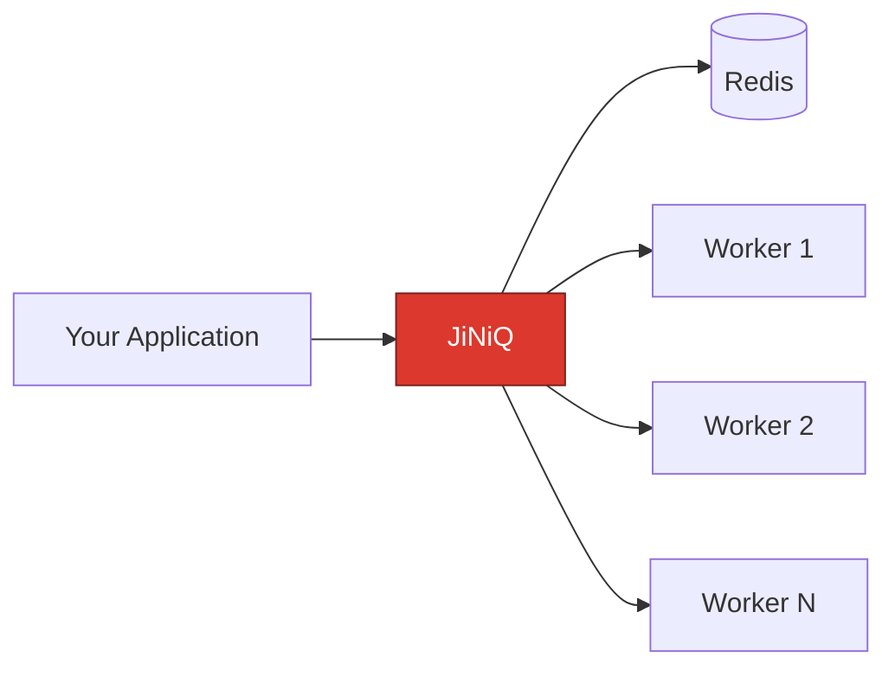

# Why JiNiQ Exists: From Simple Functions to Reliable Background Processing

> **TL;DR** — Background jobs always start simple and always end up complicated. JiNiQ is the layer that handles the "complicated" part — worker coordination, retries, priorities, delays, and crash recovery — on top of Redis, so you never have to build it yourself.



Application → JiNiQ → Redis → Workers. That's the whole picture. Everything below explains *why* it has to look like this.

---

### 📍 Where this story is going

If you've ever written a function that sends an email, processes a payment, generates a report, or handles some background work — and just called it directly — this doc is for you.

It walks through the exact sequence of problems every growing application hits: when simple function calls slowly turn into unreliable background work, and why each problem naturally pushes you toward building a proper job queue.

You don't have to take our word for it. Read the journey, and see if you don't arrive at the same place we did.

1. [Your application works... until it grows](https://www.google.com/search?q=%23your-application-works-until-it-grows)
2. [Level 0 – The Synchronous World](https://www.google.com/search?q=%23level-0-the-synchronous-world)
3. [Level 1 – Moving Work Into the Background](https://www.google.com/search?q=%23level-1-moving-work-into-the-background)
4. [Level 2 – The Problem of Losing Jobs](https://www.google.com/search?q=%23level-2-the-problem-of-losing-jobs)
5. [Level 3 – Jobs Become Data](https://www.google.com/search?q=%23level-3-jobs-become-data)
6. [Level 4 – Why Not Just Use a Database?](https://www.google.com/search?q=%23level-4-why-not-just-use-a-database)
7. [Level 5 – Why Redis?](https://www.google.com/search?q=%23level-5-why-redis)
8. [Level 6 – Why Not Build a Queue Yourself?](https://www.google.com/search?q=%23level-6-why-not-build-a-queue-yourself)
9. [Level 7 – JiNiQ](https://www.google.com/search?q=%23level-7-jiniq)
10. [The JiNiQ Philosophy](https://www.google.com/search?q=%23the-jiniq-philosophy)
11. [Final Thought](https://www.google.com/search?q=%23final-thought)

---

## Your application works... until it grows

When you're building an application, most tasks start out simple.

A user signs up. The backend needs to:

* Create the user account
* Send a welcome email
* Generate a profile image
* Update recommendations
* Send notifications

So you write the obvious thing:

```javascript
async function signup(user) {
  await createUser(user);
  await sendWelcomeEmail(user);
  await generateRecommendations(user);
}

```

**And it works.** For a small application, this is perfectly fine — clean, readable, easy to reason about.

The problem doesn't show up on day one. It shows up when the application *grows*. And by then, this pattern is wired into everything.

---

## Level 0: The Synchronous World

### The first problem: not all work belongs inside a request

Some operations are just naturally slow:

* Sending emails
* Processing images
* Generating reports
* Video processing
* Data exports
* Machine learning inference
* Third-party API calls

Here's the thing: **the user doesn't care how long these take internally.** They only care about one question —

> "Did my request succeed?"

But your server is making them sit and wait for work they'll never see happen.

```
User Signup Request
────────────────────────────────
Create User              50ms
Send Email               3 seconds
Generate Avatar          5 seconds
Update Analytics         2 seconds
────────────────────────────────
Total Response Time      10 seconds

```

Ten seconds. For work the user has zero visibility into. That's not a UX problem you can fix with a loading spinner — it's an architecture problem.

The first improvement is obvious once you see it:

**Move slow work outside the user request.**

---

## Level 1: Moving Work Into the Background

The architecture shifts to something like this:

```
              API Server
                  |
                  v
          Background Worker
                  |
                  v
             Heavy Task

```

Now your API responds instantly:

```javascript
async function signup(user) {
  await createUser(user);

  queue.add({
    type: "send_email",
    data: user
  });

  return "Account created";
}

```

This *feels* like the solution. Response times drop. Users are happy. You ship it and move on.

But one question is quietly waiting for you:

**Where does this background work actually live?**

---

## Level 2: The Problem of Losing Jobs

The simplest possible answer: keep jobs in memory.

```javascript
const jobs = [];

jobs.push({
  type: "send_email",
  user: "abc@example.com"
});

```

This works great... until the server restarts.

```
Application Memory
───────────────────
[
 send_email_job,
 generate_report_job,
 image_processing_job
]

        Server crashes
              |
      Memory cleared
              |
      Jobs lost forever

```

And just like that:

* ❌ Emails are never sent
* ❌ Reports are never generated
* ❌ Notifications disappear silently

This is the moment a background job stops being "a function call you didn't want to wait for" and becomes something more serious:

> **A background job is important data. It needs persistence, recovery, and state tracking.**

---

## Level 3: Jobs Become Data

A job now needs to be *stored* somewhere, as a real record:

```json
{
  "id": "job_123",
  "type": "send_email",
  "payload": {
    "email": "user@example.com"
  },
  "status": "waiting"
}

```

Which means your application now needs a system that can:

* Store jobs
* Find available jobs
* Assign jobs to workers
* Track progress
* Handle failures

Congratulations — without meaning to, **you've started building a queue.**

---

## Level 4: Why Not Just Use a Database?

The natural next thought is:

> "I already have PostgreSQL / MySQL / MongoDB. Why not store jobs there?"

Fair question. Databases are excellent for application data:

* Users
* Orders
* Payments
* Products
* Transactions

But queues have a fundamentally different access pattern. A queue is constantly doing this, **thousands or millions of times a day:**

* Add new job
* Find next job
* Claim job
* Move job
* Retry job
* Expire job
* Update status

And little by little, your database starts becoming responsible for things it was never designed to do:

* Scheduling
* Ordering
* Worker coordination
* Locking
* Job recovery

At this point you're not "using a database" anymore. **You're building a queue system inside a database** — and fighting its indexing, locking, and transaction model the entire way.

---

## Level 5: Why Redis?

A queue needs a system optimized for a very specific set of things:

* ⚡ Very fast reads and writes
* 🔒 Atomic operations
* 📶 Ordering
* ⏱️ Expiration
* 🌐 Distributed coordination

Redis provides all five of these **natively.** And instead of jamming every requirement into one table, different parts of a queue can lean on different Redis data structures, each one a natural fit:

#### Waiting Jobs

**Problem:** *"Store jobs that are ready to execute."*
**Redis List:**

```
waiting_queue
  job_1
  job_2
  job_3

```

#### Priority Jobs

**Problem:** *"Some jobs are more important than others."*

Not this:

```
A
B
C

```

This:

```
Payment
Critical Task
Normal Email

```

**Redis Sorted Set:**

```
priority_queue
  payment_job   → 100
  email_job     → 10

```

**The Hidden Trap (Starvation):** If you just use one Sorted Set, a constant stream of high-priority jobs will push normal jobs down forever. They *starve*.

**The JiNiQ Solution:** JiNiQ uses a **Two-Queue Anti-Starvation model**. It keeps normal and priority jobs in separate queues, merging them at claim-time with a time-offset. High-priority jobs get a head start, but older normal jobs eventually outrank brand-new priority ones.

#### Delayed Jobs

**Problem:** *"Run this job after a specific time."*

The tempting-but-broken approach:

```javascript
setTimeout(() => {
  processJob();
}, 3600000);

```

Timers only exist in application memory:

```
Server Restart
      |
Timer disappears
      |
Job disappears

```

A production scheduler needs persistence. **Redis stores delayed execution as data:**

```
delayed_jobs
  send_reminder_job  → 10:30 AM
  generate_report    → 12:00 PM

```

---

## Level 6: Why Not Build a Queue Yourself?

At this point, a lot of developers think: *"Fine — I'll just build my own Redis queue."*

And honestly, at first, it looks easy:

```javascript
queue.add(job);
worker.process();

```

Here's the catch — **adding and removing jobs was never the hard part.** Reliability is.

A production queue has to answer some genuinely hard questions.

### Problem 1: Multiple Workers

One worker is simple:

```
Queue
  |
Worker

```

Production is not:

```
                 Worker A

Producer ---> Redis Queue

                 Worker B

                 Worker C

```

Now: **who gets the job?** What happens when two workers grab the same one?

```
Worker A sees job_1
Worker B sees job_1
Both execute job_1

```

Sending a duplicate email is annoying. **Processing a duplicate payment is dangerous.** You need safe, atomic job ownership — not a "probably fine" race condition.

**The JiNiQ Solution:** JiNiQ doesn't rely on flaky application-level locks. Every state transition (like finding a job, moving it to active, and locking it) happens through **server-side Lua scripts**. Redis runs these scripts as one indivisible operation, guaranteeing two workers can never claim the same job.

### Problem 2: Job Lifecycle Management

A real job isn't just `exists → deleted`. It moves through a full lifecycle:

```
             Add Job
                |
             WAITING
                |
             ACTIVE
          /          \
   COMPLETED        FAILED
                       |
                     RETRY
                       |
                     DEAD

```

A production system has to be able to answer, at any moment: How many jobs are waiting? Which are running? Which worker owns which job? Which failed? Which need a retry?

### Problem 3: Worker Failures

```
Worker picks job
        |
Processing payment
        |
Worker crashes

```

The job is still marked *active* — **but nobody is processing it anymore.** Without a recovery mechanism, that job is stuck forever. A reliable system needs:

```
Worker heartbeat → Detect failure → Recover job → Retry execution

```

### Problem 4: Retry Handling

Failures are inevitable: network timeouts, external APIs going down, a database hiccup. A production queue needs a real retry ladder:

```
Attempt 1 → Failure → Attempt 2 → Failure → Attempt 3 → Dead Letter Queue

```

Without this, **temporary failures quietly become permanent failures**, and important work just vanishes.

### Problem 5: Scheduling Future Work

*"Send this reminder tomorrow." "Generate this report every night." "Process this payment after 30 minutes."*

A `setTimeout` cannot survive:

* Application restarts
* Multiple servers
* Large numbers of scheduled tasks

Scheduling has to become persistent data, not a fragile in-memory timer.

### Problem 6: Observability

Once you have thousands of jobs in flight, you need real answers to real questions: How many are waiting? How many failed? Which workers are active? Which jobs are slow? How many retries happened?

Without proper tracking, **debugging turns into guesswork** — at 2 AM, during an incident, with customers watching.

---

## Level 7: JiNiQ

By this point, without ever deciding to, a team has started building:

* A scheduler
* A worker coordinator
* A retry engine
* A distributed locking system
* A failure recovery mechanism
* A monitoring system

That's not a queue anymore. That's an entire distributed systems project, hiding inside what started as a "send an email in the background" task.

**JiNiQ exists to give you all of this as a reusable library — so you never have to build it from scratch.**

### What JiNiQ provides

Instead of every team independently reinventing:

| Redis data structures | Queue management | Worker coordination |
| --- | --- | --- |
| **Atomic job claiming** | **Heartbeat handling** | **Retry logic** |
| **Delayed execution** | **Failure recovery** |  |

...JiNiQ provides a single, reliable execution layer built on top of Redis, tested against exactly the failure modes described above.

---

## The JiNiQ Philosophy

JiNiQ wasn't created because *adding a job to a queue* is difficult. Adding a job is easy — it always has been.

**The hard part is making background processing reliable when:**

* servers crash
* workers scale horizontally
* jobs fail
* execution takes time
* priorities matter
* scheduling is required

A simple queue answers one question: *"How do I store a job?"*

A production queue has to answer all of these:

* Who owns the job?
* What happens if the worker dies?
* When should this execute?
* How many times should it retry?
* How do we recover from failures?
* How do we observe the system?

**JiNiQ exists to solve the second set of problems — the ones that actually determine whether your background processing is trustworthy.**

### From application code to distributed processing

**Before JiNiQ:**

```
Application
    +
Custom queue logic
    +
Failure handling
    +
Worker management
    +
Retry system
    +
Scheduling
    +
Recovery

```

**After JiNiQ:**

```
Application
    |
  JiNiQ
    |
Reliable background execution

```

Same outcome. A fraction of the code you have to own, test, and debug at 2 AM.

---

## Final Thought

Every growing application eventually needs background processing. That part isn't optional — it's just a matter of time.

So the real question was never:

> "Will I need a queue?"

It's this one:

> **"Will I build the same distributed queue infrastructure everyone else has already built — or use a system designed around these exact problems from day one?"**

JiNiQ lets you focus on your application logic, and hands the complexity of reliable background execution — coordination, retries, priorities, delays, crash recovery, observability — to a system built specifically to carry that weight.

---

<div align="center">

**Ready to stop rebuilding the same queue infrastructure?**

Get started with JiNiQ →

</div>