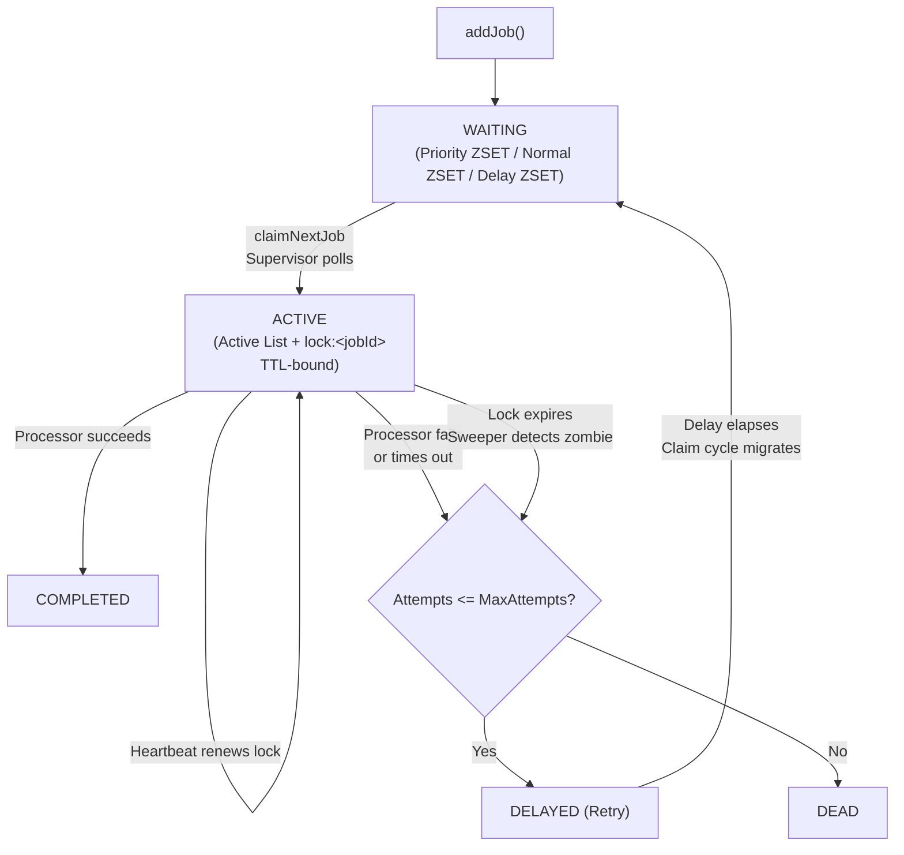

# Job Lifecycle

Every job moves through a small, well-defined state machine. Every transition is a single Lua script — there is no state a job can be caught "between."



## States

| State | Where it lives | Set by |
| --- | --- | --- |
| `waiting` (priority) | `priority` ZSET, scored by `timestamp - priorityOffset` | `addJobtoQueue` Lua |
| `waiting` (normal) | `normal` ZSET, scored by `timestamp` | `addJobtoQueue` Lua |
| `waiting` (delayed) | `delay` ZSET, scored by `runAt` | `addJobtoQueue` Lua |
| `active` | `active` list (`jobId:workerId` entries) + `lock:<jobId>` key, job hash `status=active` | `claimNextJob` Lua |
| `completed` | `complete` list, job hash `status=completed` | `checkAndComplete` Lua |
| `delayed` (retry) | `delay` ZSET, job hash `status=delayed`, `attempt` incremented | `addToDelayedOrDead` Lua or `sweeper` Lua |
| `dead` | `dead` list, job hash `status=dead` | `addToDelayedOrDead` Lua or `sweeper` Lua |

## Key invariant: only two ways out of `active`

A job leaves the `active` list in exactly two ways, and both are Lua-atomic:

1. **Normal completion/failure path** — `JobExecutor` calls `addToCompleted` or `addToFailed` after the user's processor function settles. Both scripts first check that the calling worker still holds the lock (`GET lockKey == workerId`) before doing anything. If ownership was lost (see #2), these become no-ops that return a sentinel the caller can detect.
2. **Sweeper path** — if a job's lock key has expired (no heartbeat renewal for a full TTL), any worker's `Sweeper` can pick it up independently of whichever worker originally claimed it, and route it to retry or dead based on `attempt` vs `maxAttempts`.

Because both paths gate on lock ownership, a job can never be double-completed or double-swept — whichever script runs first "wins" atomically, and the second sees the lock is already gone.

## Retry accounting

`attempt` is stored on the job's own hash and incremented with `HINCRBY` (atomic, no read-modify-write race) both in the normal failure path and in the sweeper path. This means a job's total attempt count is accurate regardless of *which* mechanism (explicit failure vs. zombie sweep) caused each retry.

```