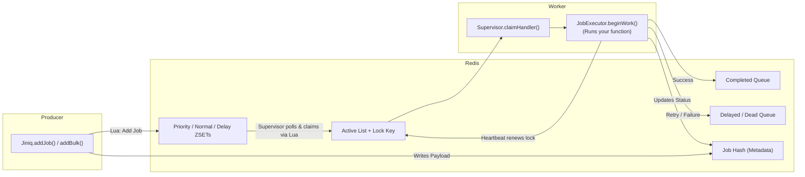

# Architecture Overview

JiNiQ has two halves that never talk to each other directly: **producers** (the `Jiniq` class) that write jobs into Redis, and **workers** (the `Worker` class) that pull jobs out and run them. Redis is the only thing that connects them. There is no broker process, no coordinator node — Redis's data structures and Lua scripting *are* the coordination layer.

## The two halves

**Producer side (`Jiniq`)**
A thin class over `RedisStorage`. `addJob()` and `addBulk()` serialize a job, run it through the `addJobtoQueue` Lua script (which handles dedup, capacity checks, and routing into the right ZSET), and emit a local event (`job:submitted` / `jobs:submitted:bulk`) for anyone listening in-process. The producer does not know or care whether a worker exists.

**Worker side (`Worker` → `Supervisor` → `JobExecutor`)**
A `Worker` owns one `Supervisor`, which is a polling loop that claims jobs whenever it has a free concurrency slot and hands each claimed job to a `JobExecutor`. Each `JobExecutor` runs your processor function, keeps a `HeartBeat` alive for the duration, and reports the outcome back to Redis. A `Sweeper` runs on a separate timer, independently reclaiming jobs whose worker died mid-execution.

## Why this split

Putting all the coordination logic in Redis (via Lua) rather than in the Node process means:

- **Workers are stateless and disposable.** Kill `-9` a worker mid-job and nothing is lost — the lock it held simply expires, and the sweeper (running on *any* worker, not necessarily the one that died) requeues the job.
- **Horizontal scaling is just "run more workers."** Every worker polls the same Redis keys; there's no leader election, no sharding logic, no worker-to-worker communication required.
- **Atomicity doesn't depend on Node's event loop.** A claim, a heartbeat renewal, a completion — each is a single Redis Lua execution. Two workers racing for the same job resolve deterministically inside Redis, not through application-level locking.

## High-level flow



See [`job-lifecycle.md`](https://www.google.com/search?q=./job-lifecycle.md) for the full state machine and [`redis-data-model.md`](https://www.google.com/search?q=./redis-data-model.md) for exactly what's stored where.

```