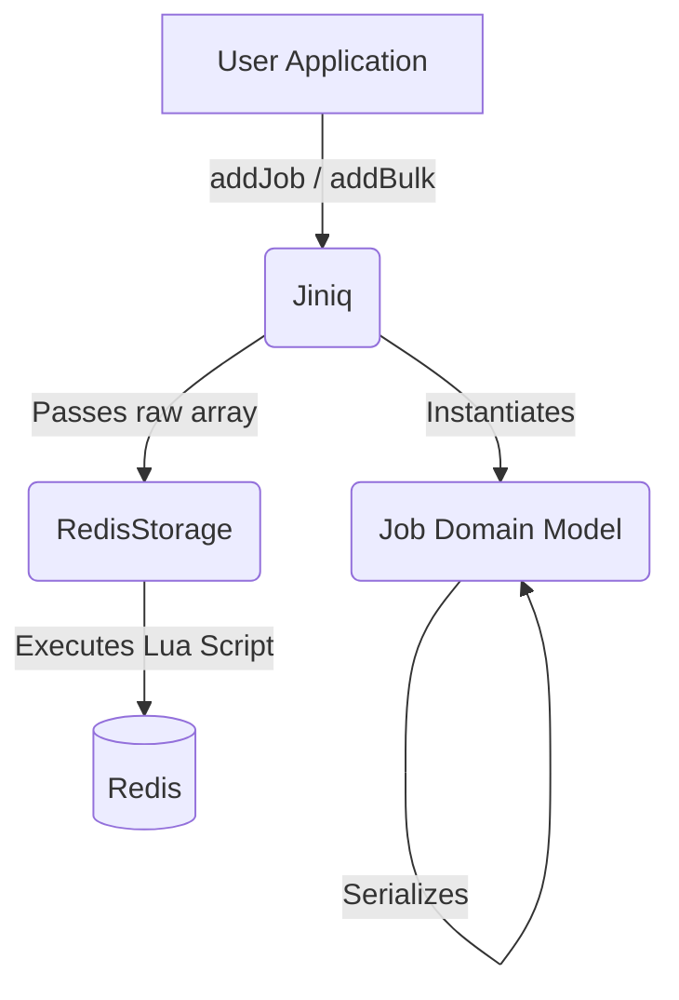

# Internals: `Jiniq` (The Producer)

**File:** `src/queue/Jiniq.js`

The `Jiniq` class is the entry point for the producer side of the system. It is intentionally lightweight, stateless, and entirely decoupled from the worker mechanics. Its only job is to validate data and safely move it into Redis.

## Architectural Position & Data Flow

`Jiniq` sits at the very top of the producer stack, acting as the bridge between your application code and the underlying Lua scripts. It follows a strict separation of concerns:

* **`Jiniq`** handles user-facing API, input validation, and batch chunking.
* **`Job`** handles domain logic, default values (like UUID generation and retry limits), and serialization.
* **`RedisStorage`** handles the actual Redis keys and Lua execution. `Jiniq` never touches Redis directly; it always speaks through `RedisStorage`.

### Connection Isolation

Architecturally, the `Jiniq` instance instantiates its own isolated `RedisDB` connections. It does **not** use the `RedisFactory` singletons used by the workers. This isolation ensures that a massive spike in producer traffic (e.g., calling `addBulk` with 100,000 jobs) cannot saturate the connection pool or block a worker's heartbeat/claim operations.

---

## Role & Responsibilities

1. **Connection Management:** Initializes its own Redis connections independent of any workers.
2. **Validation:** Enforces strict limits on job structure and payload size.
3. **Serialization:** Wraps raw data in the `Job` domain model to ensure consistent metadata.
4. **Insertion:** Delegates the actual Redis writes to `RedisStorage` (which executes the `addJobtoQueue` Lua script).

---

## The `addJob` Flow

When a user calls `await queue.addJob("resize", { img: "123" }, { priority: "high" })`:

1. **Validation:** It first checks that the `payload` is within the 1MB limit. Massive payloads cause latency spikes in Redis; JiNiQ enforces this boundary to keep the queue fast.
2. **Domain Wrapping:** It constructs a `new Job(...)` instance. If the user didn't provide a custom `id`, this step generates a `crypto.randomUUID()`. It also applies default options — normal priority, 0 delay, and **0 max attempts (no retries) unless you explicitly pass `maxAttempts`** — so a job that isn't given a retry budget goes straight to the dead-letter queue on its first failure.
3. **Serialization:** It calls `job.toRedisHash()`, which flattens the object into an array of alternating keys and values (the format required by Redis `HSET`).
4. **Lua Execution:** It passes the flattened data to `RedisStorage.addJobToQueue()`.
* *Note:* Because this triggers a Lua script, the job is atomically checked for duplicates (via `EXISTS`), checked against `maxQueueSize` (throwing a `QueueFullError` if exceeded), written to the `main:<jobId>` Hash, and sorted into the correct waiting ZSET (`priority`, `normal`, or `delay`) in one indivisible step.

5. **Event Emission:** It emits a local `job:submitted` event via `EventEmitter` and returns the domain `Job` object to the caller.

---

## Bulk Submission (`addBulk`)

Inserting 10,000 jobs sequentially via `addJob` would incur 10,000 network round-trips. To solve this, `Jiniq` provides `addBulk(jobs)`.

Instead of raw iteration, `addBulk`:

1. Maps the raw job inputs into serialized `Job` objects.
2. Chunks them into batches (default: 1,000 jobs per chunk).
3. Passes each chunk to `RedisStorage.addBulkJobs()`, which uses Redis pipelining to send the Lua executions in a single network request per chunk.
4. Returns an array of `{ jobId, success, error }` results.

**Why chunking?** Pipelining 100,000 commands at once can cause Redis to allocate massive query buffers and temporarily block other clients. Chunking keeps memory usage flat and latency predictable.

---

## Complete Decoupling

The `Jiniq` producer class does not know if any `Worker` instances exist, what their concurrency is, or if they are currently crashed. It operates on a pure fire-and-forget model. The moment the Lua script returns `1`, the producer's job is completely finished, and the state machine takes over.